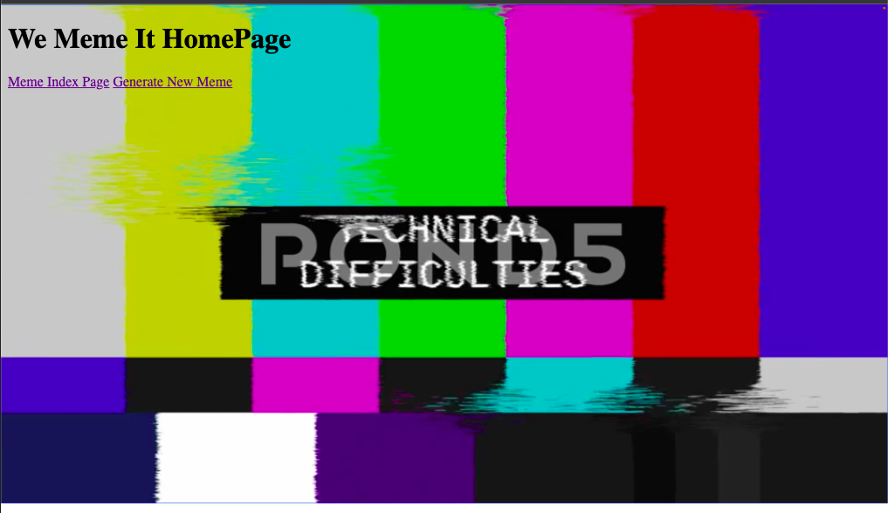
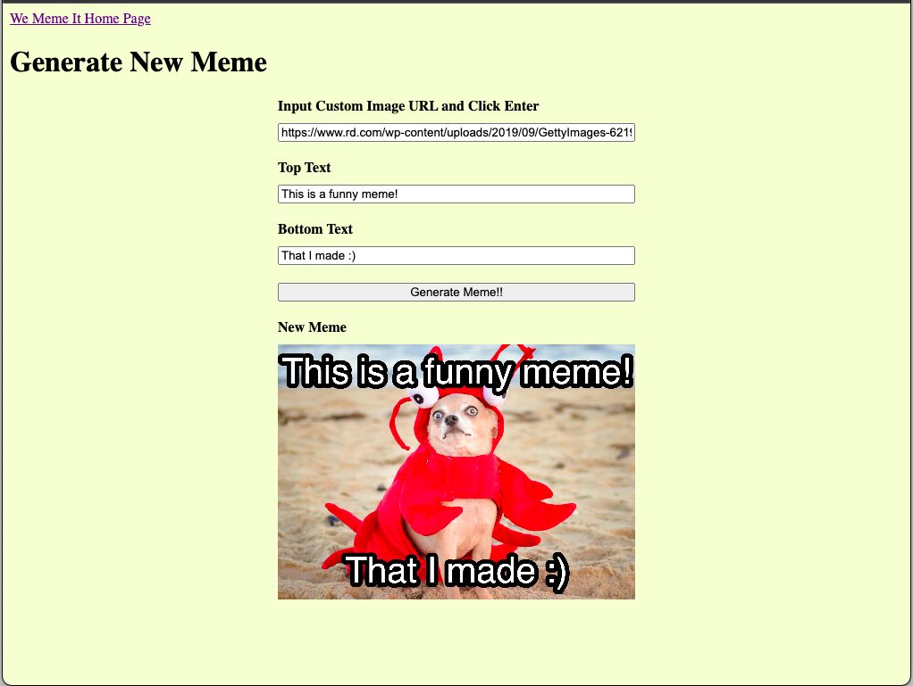
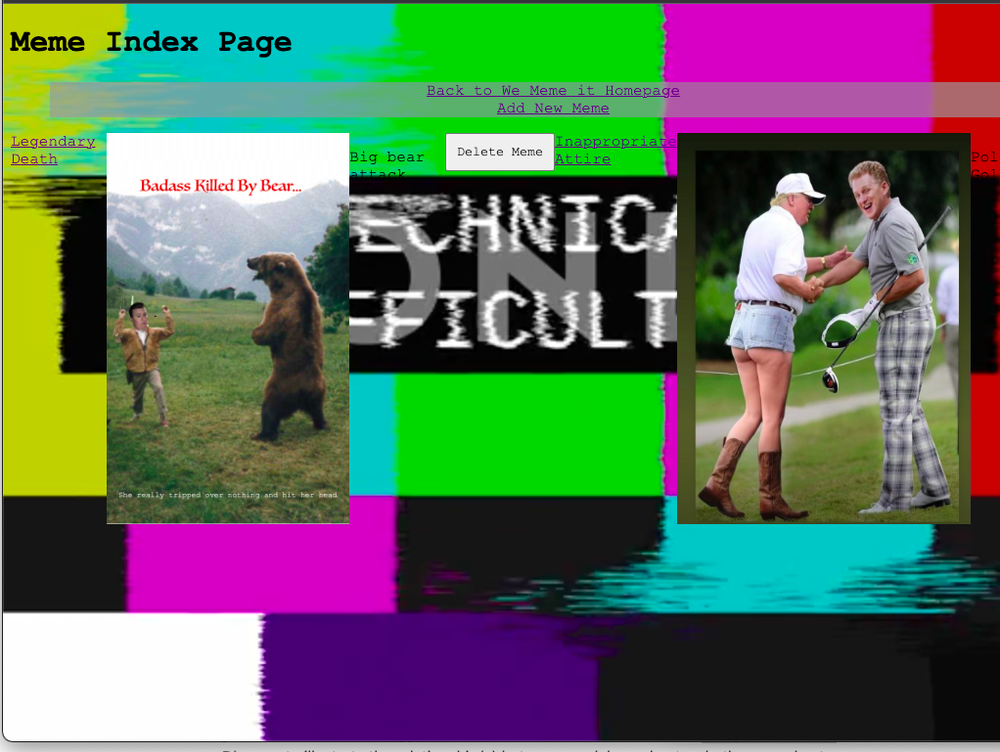
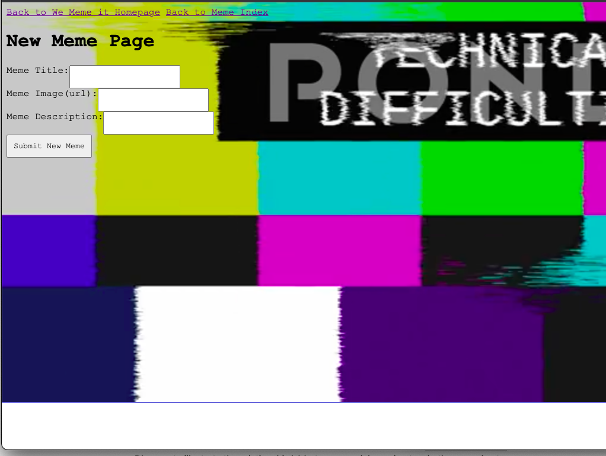
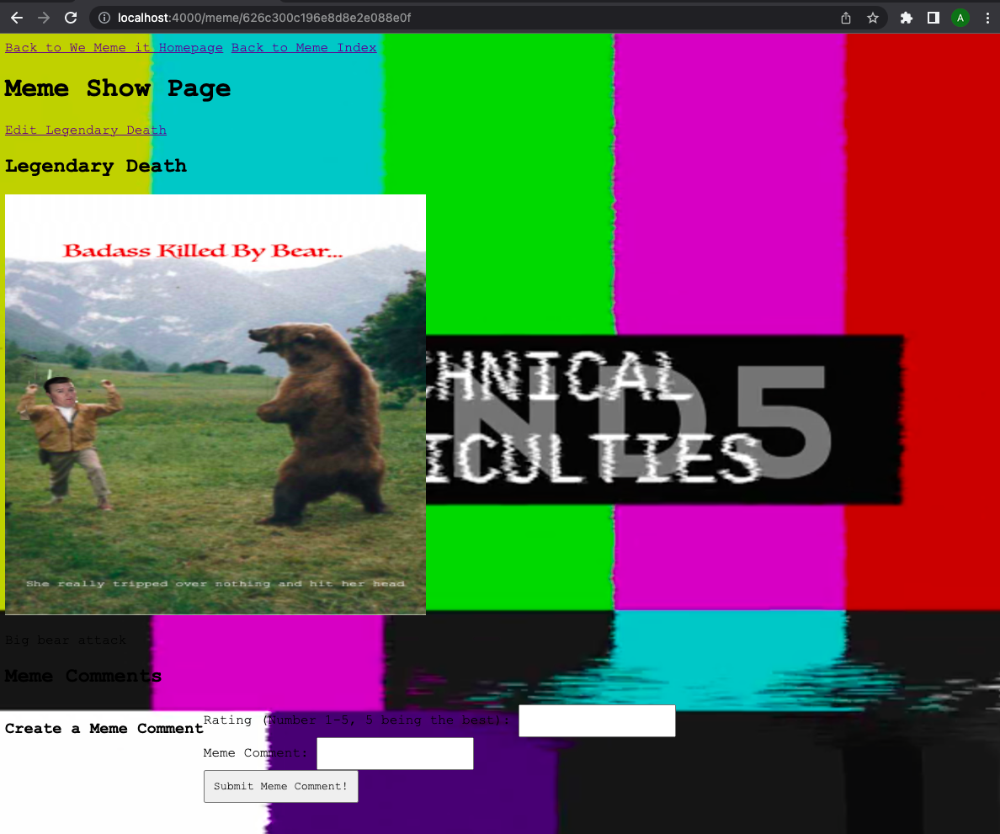
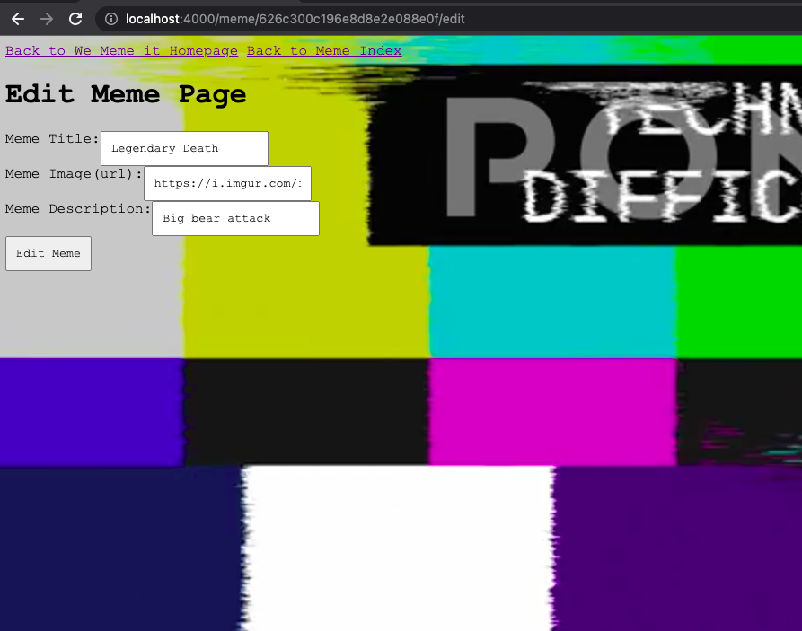

# Project2_MemeWebsite
Meme Website with Amber and Andrew

We have developed a cool Meme site (We Meme It!!) with some cool features and an expanding Meme index!

User Stories: 

In this meme site, users can look at the collected meme index contributed to by our users. Users can look at the different memes, edit the descriptions, or come up with new funny titles for the memes. Users can also add to the meme index database as well with the "add a new meme" link!

A cool new feature is the Meme Generator! With this feature, users can copy and paste the URL from any funny image from the internet and create unique bottom and top lines of descriptive jokes or other text!

User Flow: 

The user begins at the home page where he or she can decide whether to interact with the meme index itself or generate his or her own unique memes. If the user choses the generate meme link, the user is redirected to a meme generator page where he or she can chose any funny image from online, copy and paste the image URL into the address field, chose top and bottom text, click "generate a new meme" and see the new funny generated meme!

If the user choses to interact with the meme index via the link on the homepage, the user will be directed to Meme viewing page. When the user clicks on the linked title of a meme, the user is then directed to the Meme's show page. On the show page, the user can edit the meme by clicking on the link above. The user is then redirected to the meme edit page where the user can change the title, add to or modify the description, or change the meme image itself. The user can also add comments and ratings to the Meme show page directly by inputing values in the comment fields below the meme image.

If the user would like to add the meme from the internet, he or she can do so by clicking on the "add new meme" link at the top of the meme index page. In the new meme page, the user can copy and paste a URL of his or her favorite online meme image into the URL input. The user must add a title for the meme and a description. The user can then submit the new, funny meme to the meme database and it will show up on the meme index page for other users to see!

Screenshots of Website Flow:

Home screen:

This is the We Meme It homepage where you can go to either the main meme index page to interact with all of the memes in the database or go to generate your own custom meme via links at the top!

Generate a Meme Page:

This is the We Meme It meme generator page where you can generate your own memes! Chose a funny image, copy and paste in the image address, add some funny text to the top and bottom and generate your new meme!

Meme Index Page:

This is the main index page of the memes in the We Meme It database! Peruse the funny memes, titles and descriptions. If you find a funny Meme online that needs to be in our database, go to our "add new meme" page via the link above to do so. To get more information about a particular meme, click on the title of the meme (the link to the upper left) to see each meme's show page with further descriptions of the meme. You can delete memes from the index too, but becareful because deleting a meme from the index deletes that meme permanently from our database of memes as well! Look at all of the fun memes!!

New Meme Page:

This is where users can contribute to our meme database by added funny new memes they have found on the internet! Users can copy and paste the url of the image into the Meme Image(url) field, add a Title, and a brief description of the meme below. Click on the Submit New Meme button to add the funny new meme to our ever growing database!

Meme Show Page: 

The meme show page shows the descriptions, titles and comments associated with the chosen meme. Users can click on the edit meme link to change specific aspects about the meme (described more in detail below). Below the funny meme, users can see the description and add to the list of comments and ratings of the meme. A rating of 5 means a meme is extremely funny, a rating of 1 means the meme is not so funny. A rating in between those two means the meme is sort of funny more or less. Let other users know your thoughts on the meme!

Meme Edit Page

In the meme edit page, users can edit aspects of the chosen meme. The user can alter the title, the meme itself via different image address/URL and can edit the description of the meme. Click Edit Meme to alter and add the updated meme to our database and index! These changes are permanent, so make sure they are desirable!!

Have fun with We Meme It!!!

Future features and directions:

We hope to be able to enable the addition of generated memes to the meme index in the future, however conversion of the canvas object to an image object remains to be a challenge. We also hope to implement meme discussions/stories in the future where users can add to discussions using memes only! Other features and activities are being considered for future iterations as well!

