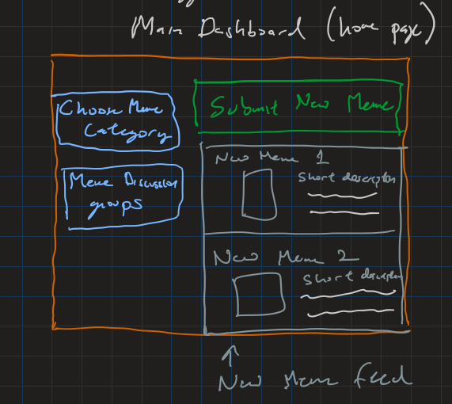
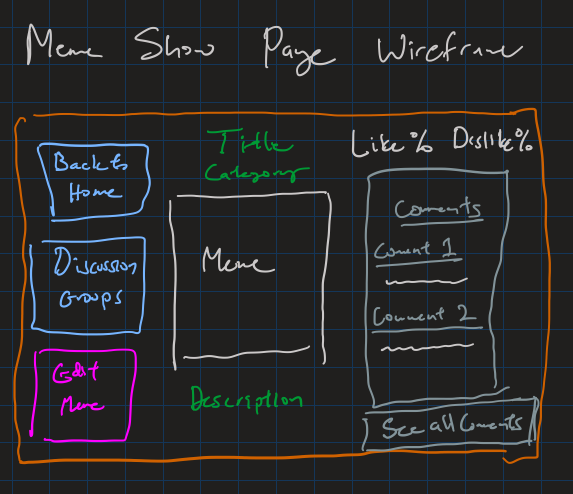
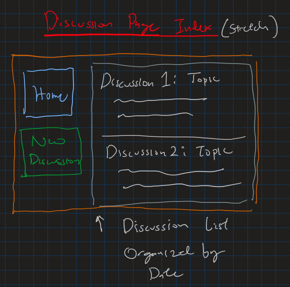
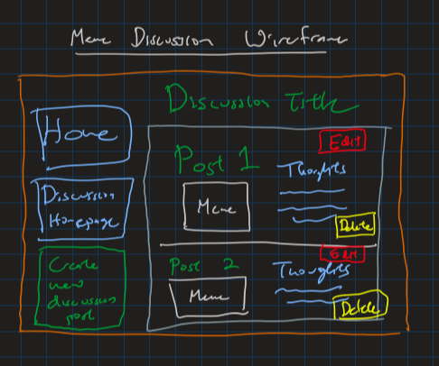

Project 2 Wireframe/User Stories Meme Website Project 2

looking at https://knowyourmeme.com/ for inspiration

Categories (for now)
1) Political Memes
2) nerdy memes 
3) Movie Memes
4) Popculture Memes
5) Pet memes
6) Cultural Memes

Other options:
1) PG13 memes vs R rated memes
2) Suggesting memes
3) discussion page for memes

Home Page: 

Different elements in home page
- Choose Meme Category button: choose from one of the categories above
- Choose discussion groups that discuss the hottest memes
- Shows most recently posted memes
- Submit New Meme Button: goes to new ejs page
- Can click on new meme feed items to get to their show pages

Meme Show Page Wireframe:

Different elements in meme show page
- back to home goes to the index page
- discussion groups button goes to discussion group page
- edit meme button goes to the edit page
- the meme has a title, category, the meme img, and description
- there is a like % and dislike % 
- there is a most recent comment feed
- there is a see all comments button that goes to a see all comments page

discussion homepage wireframe: (stretch)
- blogs about memes with custom topics and memes

Different elements in discussion home page
- back to home button
- new discussion button
- list of discussions to show pages of discussions
- click on discussions to see show page of each discussion

discussion show page wireframe:

Different elements in meme discussion show page
- back to home button
- back to discussion homepage button
- create newe discussion post page
- Discussion Title
- posts with memes and edit/delete buttons
